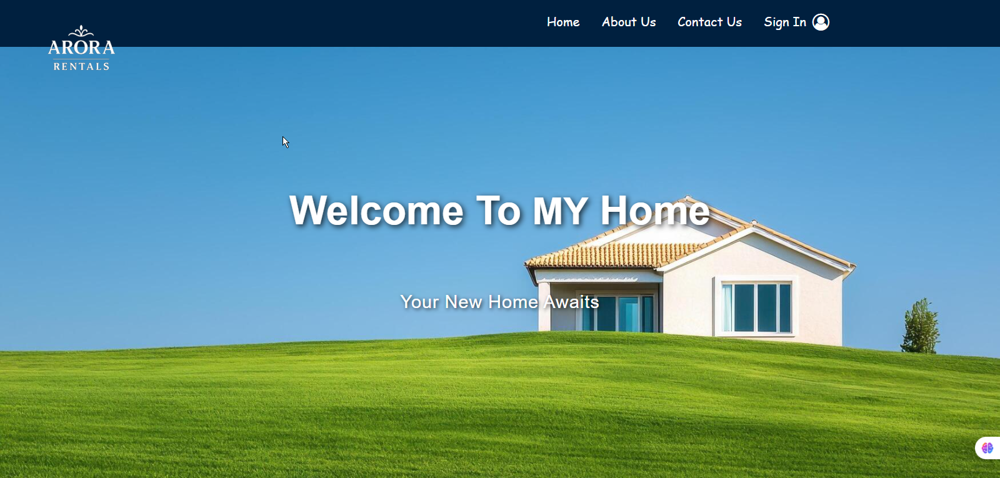
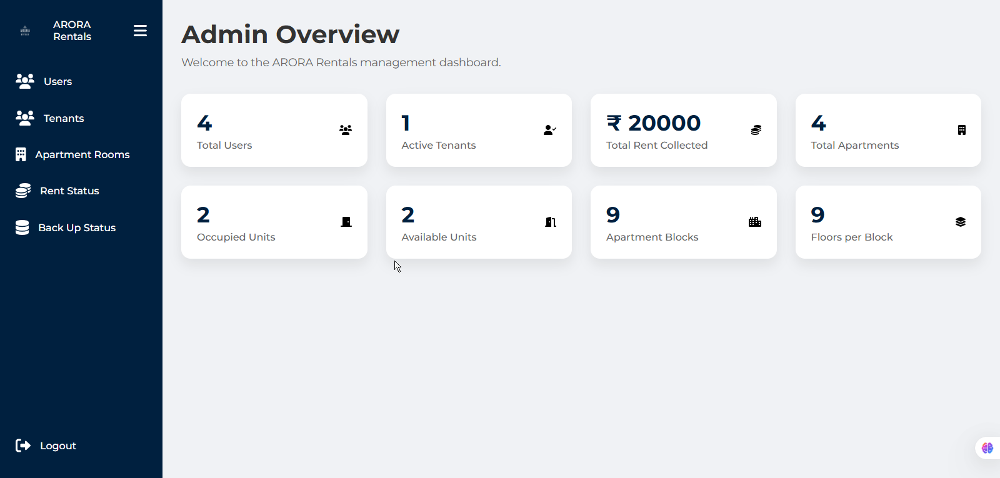

# 🏢 ARORA Rentals - Apartment Rental Management System

**Developer:** Anant Arora  
**Course Project:** 5th Semester DBMS Internal Project  

ARORA Rentals is a modern web application built to digitize and streamline the entire apartment rental process. It replaces traditional, manual systems with a centralized, secure, and user-friendly platform. Tenants can browse and rent properties, landlords can list their own apartments, and administrators can manage the entire rental business through a powerful dashboard.

---

## 🚀 Project Summary

- **Objective:** Provide a fully functional apartment rental management system.  
- **Purpose:** Save time, improve efficiency, and enhance user experience.  
- **Outcome:** A clean, professional, and intuitive rental solution for tenants, property owners, and administrators.  

---

## 🛠️ Technology Stack

| Category       | Technology / Language |
|----------------|------------------------|
| **Frontend**   | HTML5, CSS3, JavaScript |
| **Backend**    | Python (Flask Framework) |
| **Database**   | MySQL |
| **Server**     | XAMPP (Apache + MySQL) |
| **Libraries**  | Flask-MySQLdb, Werkzeug |
| **Version Control** | Git & GitHub |

---

## ✅ Features

### 👤 User / Tenant Features
- Secure Authentication with password hashing  
- Personalized Dashboard with user-specific data  
- Browse & Search Properties with filters  
- List Your Own Property with a simple form  
- Full Rental Workflow including digital contract

### 👑 Admin Features
- Secure Admin Portal  
- Dashboard with system statistics  
- Property Management (add, view, delete)  
- User & Tenant Management  
- Rent Status Report with late fee handling  
- Backup System with deleted tenant logs  

### 💳 Payment Features
- Integrated Payment Workflow after contract signing  
- Auto-filled Payment Form  
- Simulated Secure Card Input  
- Instant Digital Receipt generation  

---

## Screenshots

Here are some key screens from the project:

### Login Page

### Tenant Dashboard

### Admin Dashboard

### Payment Page

## 📁 Project Structure

The project follows a standard Flask application structure, separating backend logic, frontend templates, static assets, and database scripts for clarity and maintainability.

